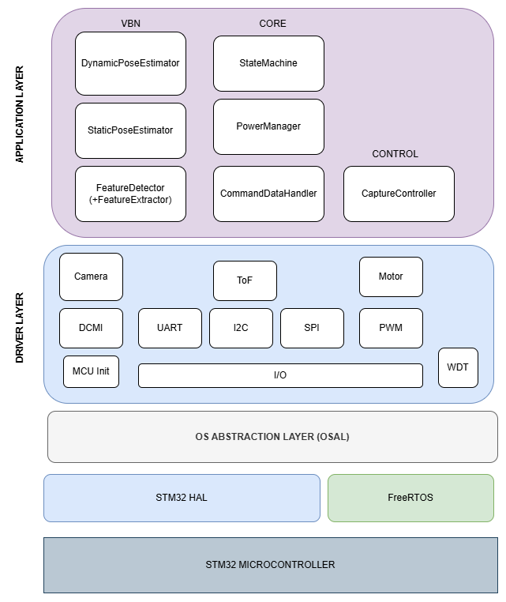

# RPOD Software Documentation
The RPOD Software follows a layered architecture with strong focus on modularity based on functional independendce and portability. Lower level hardware platform is abstracted with each layer using HAL, Drivers and Device Drivers with Application Layer containing mission logic being completely hardware agnostic thus portable. It allows for easy testing on Linux PC environment during development allowing for faster development cycles. An OSAL OS Abstraction Layer is implemented which wraps around platform specific implementation of core functionality of an RTOS.

## Application Layer